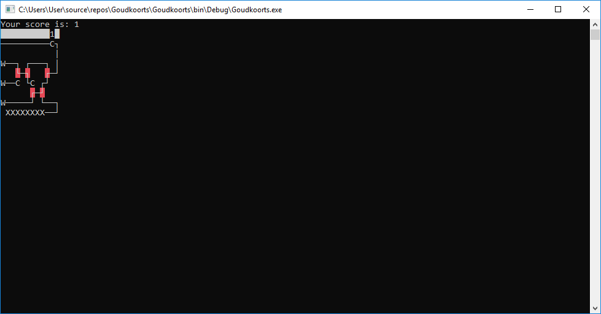

# Goudkoorts 
by Bram-Boris Meerlo and Peter-Jan Gootzen for a Software Architecture assessment for Avans Hogeschool

## Screenshots

## Controls
Press 1 through 5 to flip the track switches

## Game rules
Your objective is to score as many points as possible, you receive 1 point by getting a cart(C) on the dock(D), when the dock has been loaded with 8 carts you get another 10 points. But watch out because if two carts collide you lose and if the last 8 spots(X) of the dead track are filled up you also lose.
